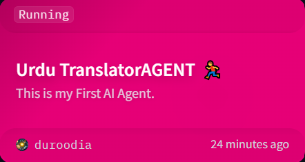
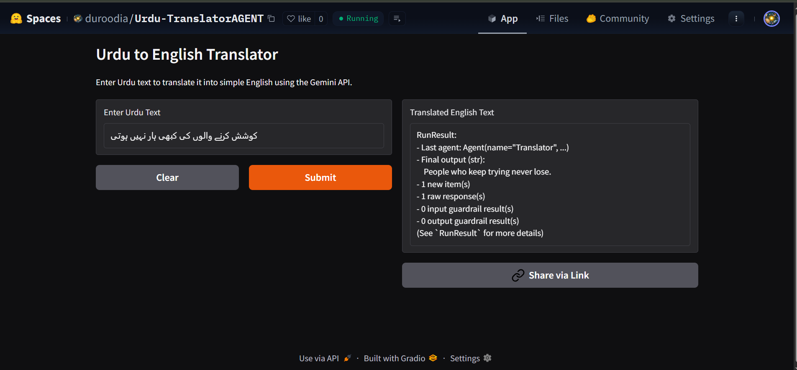

# First Translator_AI_agent🎯
# Explaining the Code: Urdu to English Translator Using Gemini API

This markdown document provides a step-by-step breakdown of the provided Python code. The code sets up an AI agent using Google's Gemini model to translate text from Urdu to simple English. 

## 📦 Installed Libraries

To run this code, you'll need to install the following Python libraries. These can be installed via pip in your terminal or command prompt. Note: The `agents` library appears to be from a framework like `swarms` or a similar AI agent toolkit (e.g., `pip install swarms` or check the specific package documentation). The code also uses OpenAI-compatible wrappers for Gemini.

- **python-dotenv**: For loading environment variables from a `.env` file.  
  Installation: `pip install python-dotenv`

- **agents** (or equivalent AI agent framework): Provides classes like `Agent`, `AsyncOpenAI`, `Runner`, etc., for building and running AI agents.  
  Installation: Assuming it's from `swarms-agents` or similar: `pip install swarms` (verify the exact package based on your setup).

- **Other dependencies**: The code uses `os` (built-in, no install needed). If `agents` requires additional libs like `openai` for compatibility, install: `pip install openai`.

Ensure you have a `.env` file in your project root with `GEMINI_API_KEY=your_api_key_here`. Get your Gemini API key from [Google AI Studio](https://aistudio.google.com/).

## 🛠️ Step-by-Step Explanation

Let's break down the code line by line. Each step includes a code snippet, an explanation of what's happening, and relevant emojis for visual flair.

### 1. Importing Necessary Modules 🔌
```python
from dotenv import load_dotenv
import os
from agents import Agent, AsyncOpenAI, Runner, OpenAIChatCompletionsModel, RunConfig
```
- **What's happening?** This imports tools for handling environment variables (`dotenv` and `os`), and AI agent components from the `agents` library. `Agent` is for creating AI agents, `AsyncOpenAI` is an asynchronous OpenAI client (adapted for Gemini), `Runner` runs the agent, `OpenAIChatCompletionsModel` defines the model, and `RunConfig` configures the run.
- **Why?** Prepares the script to load secrets securely and use AI frameworks. Emojis: 📥 (importing), 🤖 (AI agents).

### 2. Loading Environment Variables and Fetching API Key 🔑
```python
load_dotenv()
gemini_api_key = os.getenv("GEMINI_API_KEY")
```
- **What's happening?** `load_dotenv()` loads variables from a `.env` file (e.g., your Gemini API key). `os.getenv()` retrieves the key as a string.
- **Why?** Keeps sensitive info like API keys out of the code for security. If the key isn't found, the next step will catch it. Emojis: 📄 (loading file), 🗝️ (key retrieval).

### 3. Checking for API Key Presence ⚠️
```python
# Check if the API key is present; if not, raise an error
if not gemini_api_key:
    raise ValueError("GEMINI_API_KEY is not set. Please ensure it is defined in your .env file.")
```
- **What's happening?** A simple conditional check: If `gemini_api_key` is falsy (e.g., None or empty), it raises a `ValueError` with a helpful message.
- **Why?** Prevents runtime errors later by ensuring the API key is set upfront. Emojis: 🚨 (error check), ❌ (if missing).

### 4. Setting Up the External Client for Gemini API 🌐
```python
#Reference: https://ai.google.dev/gemini-api/docs/openai
external_client = AsyncOpenAI(
    api_key=gemini_api_key,
    base_url="https://generativelanguage.googleapis.com/v1beta/openai/",
)
```
- **What's happening?** Creates an `AsyncOpenAI` client instance, passing the Gemini API key and a custom base URL. This adapts OpenAI's API style to work with Google's Gemini endpoint (as per the referenced docs).
- **Why?** Allows using Gemini models via an OpenAI-compatible interface for easier integration. Emojis: 🔗 (connection), ☁️ (cloud API).

### 5. Defining the AI Model 🤖
```python
model = OpenAIChatCompletionsModel(
    model="gemini-2.0-flash",
    openai_client=external_client
)
```
- **What's happening?** Instantiates an `OpenAIChatCompletionsModel` with the "gemini-2.0-flash" model (a fast, lightweight Gemini variant) and links it to the external client.
- **Why?** Specifies which AI model to use for chat completions (e.g., translations). Emojis: ⚡ (flash model), 🧠 (AI brain).

### 6. Configuring the Run Settings ⚙️
```python
config = RunConfig(
    model=model,
    model_provider=external_client,
    tracing_disabled=True
)
```
- **What's happening?** Creates a `RunConfig` object with the model, provider (the client), and disables tracing (likely for performance or privacy, avoiding logs).
- **Why?** Customizes how the agent will run, ensuring it uses the right model without extra overhead. Emojis: 🛠️ (config), 🚫 (tracing off).

### 7. Creating the Translator Agent 🗣️
```python
agent = Agent(
    name = "Translator",
    instructions = "You are a helpful translator. Translate text from Urdu to simple English",
)
```
- **What's happening?** Initializes an `Agent` with a name ("Translator") and instructions defining its role: Translate Urdu to simple English.
- **Why?** Defines a specialized AI agent focused on translation tasks. Emojis: 🌍 (languages), 📖 (instructions).

### 8. Running the Agent and Printing the Response 🏃‍♂️
```python
response = Runner.run_sync(
    agent,
    input = "مشکلات میں بھی خوشی تلاش کرو، یہ تمہیں مضبوط بنائے گا۔",
    run_config = config
)
print(response)
```
- **What's happening?** Uses `Runner.run_sync` to execute the agent synchronously. It passes the agent, an Urdu input string (meaning: "Find happiness even in difficulties, it will make you stronger."), and the config. The response (likely the English translation) is stored and printed.
- **Why?** Triggers the translation via the Gemini model and outputs the result. Emojis: ▶️ (run), 🖨️ (print).

## 🌟 Beautiful Summary

In the dance of code and cognition, this script weaves a bridge between worlds: From the poetic curves of Urdu script to the straightforward grace of simple English. Like a digital linguist awakening under the stars of Gemini's intelligence, it loads secrets from hidden realms, crafts an agent of translation, and breathes life into words across languages. With each line, it reminds us that technology, at its heart, is a harmonious translator of human expression—turning challenges into strength, one API call at a time. ✨
It's my first ever AI project, that created by Google AI Studio using Google Gemini API Key.
## Receiving the API Key from Google AI Studio:⛳


## Here's the code snippet that successfully runs the script file & responds to the input.💡


# Deployment on the Huggingface Spaces 🤗

This project is a web-based Urdu to English translator deployed on Hugging Face Spaces. It uses Google's Gemini API to translate Urdu text into simple English through an interactive Gradio interface.
Setup Instructions

Clone the Repository: Clone this Space or download the files.
Install Dependencies: Run `pip install -r requirements.txt` to install required libraries (`gradio`, `python-dotenv`, `agents`).
Set Environment Variable: Put the api key on the Secrets with its environment variable, like `GEMINI_API_KEY` (obtain from Google AI Studio).
Run the App: Execute `python app.py` to launch the Gradio interface locally, or access it directly via the Hugging Face Space URL.
Usage: Enter Urdu text in the input box, and the app will display the translated English text.

### Requirements

* `Python 3.10`
* Libraries listed in `requirements.txt`

### Files

* `app.py`: Gradio app script for the translator interface.
* `requirements.txt`: Dependency list.
* `Secrets`: Stores the Gemini API key (not included in repository).
* `README.md`: This file.


### Running Project on Huggingface ⏬


### Working Project on the Huggingface ◀️



### Link of the Deployment on HuggingFace🤗
[HuggingFace Spaces](https://huggingface.co/spaces/duroodia/Urdu-TranslatorAGENT)

### I have just posted on my LinkedIn profile, but if anyone want to get the reference, then here's the post's link as well. Please check it out.📃
https://www.linkedin.com/posts/mariam-saad-b8645335b_github-mariam-2324firstaiagent-its-activity-7340078419835088898-oH_U?utm_source=share&utm_medium=member_desktop&rcm=ACoAAFmWz9YBrV8xis_j6-imtDqR4hnDZpvqQtw

